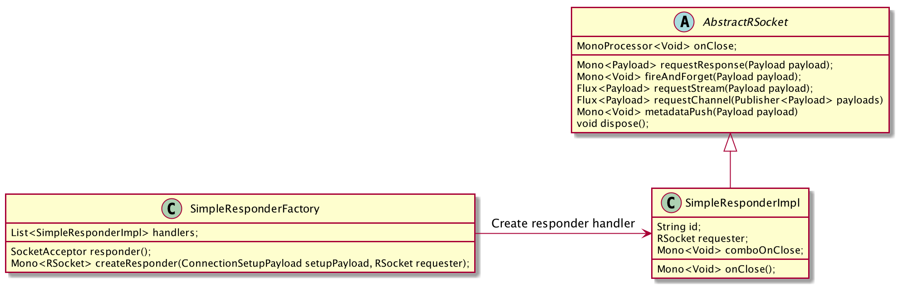

RSocket Simple Demo
===================

RSocket simple demo for responder creation, unit test for local etc.

# Responder creation



# Local Test with JUnit 5

RSocketLocalExtension & RSocketLocalTest

# Logback configuration for debug

```xml
<logger name="io.rsocket.FrameLogger" level="DEBUG"/>
```